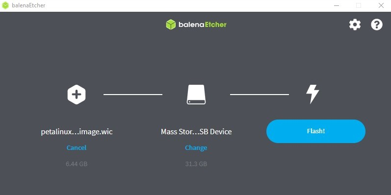
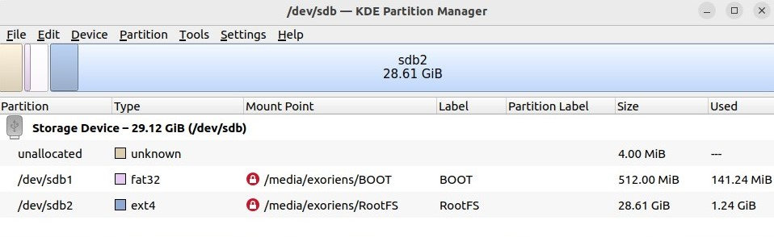
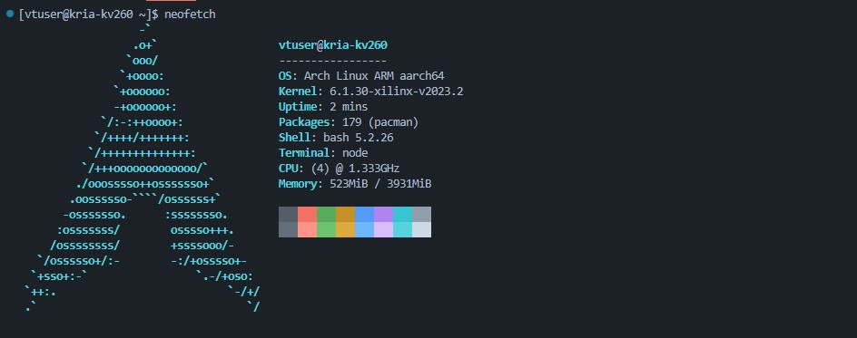
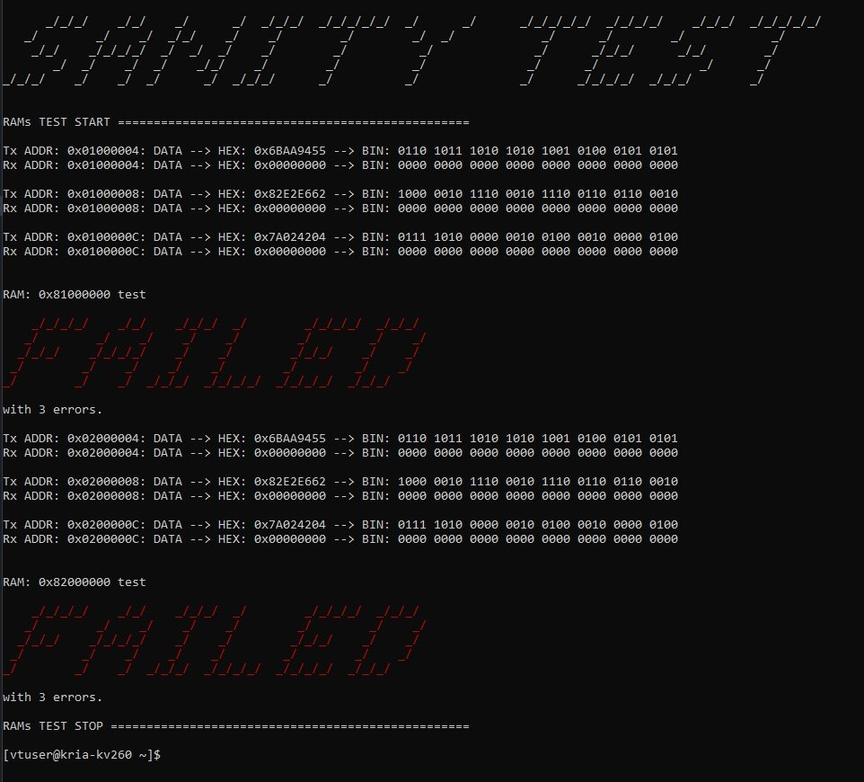
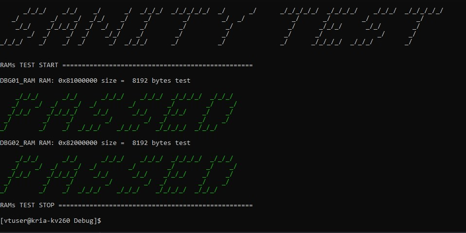

# Zynq™ UltraScale+™ MPSoC (Kria KV260) Arch Linux
1. [Introduction](#introduction)
2. [Overview](#overview)
3. [FPGA Project (Kria KV260)](#fpga-project-kria-kv260)    
    * [Requirements](#requirements)
    * [Upgrading PetaLinux Tools](#upgrading-petalinux-tools)
    * [FPGA Design](#fpga-design)
4. [Petalinux Project](#petalinux-project)
    * [Requirements](#requirements-1)
    * [Creating a Petalinux Project from XSA](#creating-a-petalinux-project-from-xsa)
    * [Configuring a Petalinux Project](#configuring-a-petalinux-project)
    * [Creating a Petalinux Project from BSP](#creating-a-petalinux-project-from-bsp)
    * [Building a Petalinux Project](#building-a-petalinux-project)  
    * [Packaging a Petalinux Project](#packaging-a-petalinux-project)
    * [Preparing the Arch Linux ARM rootfs](#preparing-the-arch-linux-arm-rootfs)
    * [Creating a WIC image](#creating-a-wic-image)
    * [Flashing an SD card with WIC image](#flashing-an-sd-card-with-wic-image)
    * [Preparing an SD card manually](#preparing-an-sd-card-manually)    
5. [Booting the Kria KV260 board](#booting-the-kria-kv260-board)
    * [Setting up the Arch Linux ARM](#setting-up-the-arch-linux-arm)
    * [Generating locales](#generating-locales)
    * [Installing packages](#installing-packages)
    * [System information](#system-information)
    * [Installing fpgautil](#installing-fpgautil)
    * [Configuring the FPGA](#configuring-the-fpga)
6. [Remote access to the Kria KV260 board](#remote-access-to-the-kria-kv260-board)
    * [Remote access using SSH](#remote-access-using-ssh)
    * [Remote development using Visual Studio Code](#remote-development-using-visual-studio-code)
7. [Testing the Kria KV260 board](#debugging-the-kria-kv260-board)
    * [Sanity test](#sanity-test)

## Introduction
The Zynq™ UltraScale+™ MPSoC (Kria KV260) Arch Linux project is designed to provide a versatile and customizable development environment tailored for the Zynq UltraScale+ MPSoC, particularly the Kria KV260 board. The primary aim of this project is to enable users to seamlessly deploy Arch Linux ARM on the Kria KV260, facilitating both FPGA configuration and Linux system development. By integrating Arch Linux ARM, renowned for its flexibility and broad hardware support, with the robust capabilities of the Zynq UltraScale+ MPSoC, this project offers a comprehensive platform for a wide range of embedded applications. Emphasizing configurability and adherence to best practices in FPGA and Linux development, this project empowers users to harness the full potential of the Kria KV260 board. 

Furthermore, the project extends its utility by offering the possibility of remote development. With remote access capabilities enabled, developers can seamlessly collaborate and work on the Kria KV260 board from any location. By leveraging SSH connections and tools like Visual Studio Code's Remote Development extension pack, developers can maintain productivity and flexibility, even when physically distant from the development hardware.

Ultimately, this project serves as a valuable resource for developers seeking to leverage the power of Arch Linux ARM in conjunction with the advanced features of the Zynq UltraScale+ MPSoC for their embedded systems projects, while also enabling efficient remote development workflows.
## Overview
The project aims to create a robust and customizable development environment for the Zynq UltraScale+ MPSoC, enabling users to deploy Arch Linux ARM on the Kria KV260 board. This environment facilitates FPGA configuration and Linux system development for a wide range of embedded applications. The project is based on the [Kria KV260](https://www.xilinx.com/products/som/kria/kv260-vision-starter-kit.html) and [PetaLinux Tools 2023.2](https://www.xilinx.com/support/download/index.html/content/xilinx/en/downloadNav/embedded-design-tools.html). For detailed information and updates refer to the official documentation and the specific hardware platform:
* [Vivado Design Suite User Guide](https://docs.xilinx.com/r/en-US/ug973-vivado-release-notes-install-license/Release-Notes)
* [PetaLinux Tools Documentation: Reference Guide (UG1144)
](https://docs.xilinx.com/r/en-US/ug1144-petalinux-tools-reference-guide)
* [Zynq UltraScale+ MPSoC](https://www.xilinx.com/products/silicon-devices/soc/zynq-ultrascale-mpsoc.html) [- Wiki](https://xilinx-wiki.atlassian.net/wiki/spaces/A/pages/444006775/Zynq+UltraScale+MPSoC)
* [Kria KV260 Vision AI Starter Kit Data Sheet (DS986)
](https://docs.xilinx.com/r/en-US/ds986-kv260-starter-kit/Summary)
* [Kria KV260 Vision AI Starter Kit User Guide (UG1089)
](https://docs.xilinx.com/r/en-US/ug1089-kv260-starter-kit/Summary)

Additionally, the guide emphasizes configuration flexibility, and adherence to best practices for FPGA and Linux development. When Arch Linux ARM is installed on the Zynq UltraScale+ MPSoC, its flexibility and customization capabilities make it an ideal environment for FPGA development. As a general-purpose Linux distribution, it accommodates diverse applications, ensuring a continuous influx of the latest updates. The broad hardware support inherent in Arch Linux ARM extends seamlessly to the specific requirements of the Zynq UltraScale+ MPSoC, making it well-suited for embedded systems development on this platform.

## FPGA Project (Kria KV260)
### Requirements
* [Vivado ML Edition 2023.2](https://www.xilinx.com/support/download/index.html/content/xilinx/en/downloadNav/vivado-design-tools.html)

### FPGA Design
A new project is created with the Vivado New Project Wizard. After the project is created, a block design is created with the Vivado IP Integrator. The block design consists of the following IP blocks:
* Zynq UltraScale+ MPSoC (set up in accordance with the requirements. The file Zynq UltraScale+ MPSoC LPD.tcl with presets for the Zynq UltraScale+ MPSoC can be found in the folder **Kria KV260**)
* Processor System Reset
* AXI Interconnect
* AXI BRAM Controllers
* Block Memory Generator
* System ILA (connected to the M_AXI_HPM0_LPD interface)

See the following image for the block design:


This is a simple example of an FPGA design to create a Petalinux project based on the [Kria KV260](https://www.xilinx.com/products/som/kria/kv260-vision-starter-kit.html). 

After the block design has been created, the design is validated, synthesized and implemented and a bitstream is generated. Then it is required to export hardware, including bitstream *<project_name>.xsa*. The XSA file is used to create a Petalinux project. The XSA file *kria_kv260_bd_wrapper.xsa* is located in the folder **Kria KV260**.

When the XSA file has been exported successfully, a Petalinux project is ready to be created.

## Petalinux Project
### Requirements
* [PetaLinux Tools Documentation: Reference Guide (UG1144)
](https://docs.xilinx.com/r/en-US/ug1144-petalinux-tools-reference-guide)
* [Ubuntu 22.04.2 LTS (virtual machine is preferred)](https://old-releases.ubuntu.com/releases/20.04.2/)
* [PetaLinux Tools 2023.2 (installed according to the documentation)](https://www.xilinx.com/support/download/index.html/content/xilinx/en/downloadNav/embedded-design-tools.html)

### Upgrading PetaLinux Tools
After the PetaLinux Tools are installed, it is necessary to upgrade the PetaLinux Tools to the latest version. The following commands are executed:
```bash
petalinux-upgrade -u http://petalinux.xilinx.com/sswreleases/rel-v2023/sdkupdate/2023.2/ -p "aarch64" --wget-args "--wait 1 -nH --cut-dirs=4"
```
### Creating a Petalinux Project from XSA
An empty project is created with the following command:
```bash
petalinux-create --type project --template zynqMP --name <project name>
cd <project name>
```
### Configuring a Petalinux Project
After the project is created, the XSA file is imported with the following command:
```bash
petalinux-config --get-hw-description ~/<file name>.xsa
```
After the XSA file has been imported successfully, the PetaLinux system configuration is opened. The following settings are changed:
```
→ Subsystem AUTO Hardware Settings  --->
	Ethernet Settings  --->
		[*] Randomise MAC address

→ FPGA Manager --->
	[*] Fpga Manager
	
→ Image Packaging Configuration --->
	Root filesystem type (INITRAMFS) --->
		(X) INITRAMFS
	(petalinux-initramfs-image) INITRAMFS/INITRD Image name
		petalinux-initramfs-image
```
Also, if needed, it is possible to implement changes to the kernel using the following command:
```bash
petalinux-config -c kernel
```
If any changes are needed to the rootfs, it is possible to implement the changes using the following command:
```bash
petalinux-config -c rootfs
```
### Creating a Petalinux Project from BSP
Create a Petalinux project from the BSP file with the following command:
```bash
petalinux-create --type project --source <path to the BSP file> --name <project name>
cd <project name>
```
### Building a Petalinux Project
After the settings have been changed, the PetaLinux system configuration is closed and the project is built with the following command (Internet connection is required for the build):
```bash
petalinux-build
```
### Packaging a Petalinux Project
After the project is built, the project is packaged with the following command:
```bash
petalinux-package --boot --format BIN --fsbl images/linux/zynqmp_fsbl.elf --u-boot images/linux/u-boot.elf --pmufw images/linux/pmufw.elf --fpga images/linux/system.bit --force
```
### Preparing the Arch Linux ARM rootfs
The Arch Linux ARM rootfs is prepared with the following commands:
* Download the latest Arch Linux ARM to the home directory:
    ```bash
    wget http://os.archlinuxarm.org/os/ArchLinuxARM-aarch64-latest.tar.gz
    ```
### Creating a WIC image
After the project is built, it is possible to create a WIC image. The following command is executed:
```bash
petalinux-package --wic --bootfiles "BOOT.BIN boot.scr Image image.ub ramdisk.cpio.gz.u-boot" --rootfs-file ~/ArchLinuxARM-aarch64-latest.tar.gz --outdir ~/<project name>/images
```
After the WIC image is created, the WIC image is located in the folder **images**.

### Flashing an SD card with WIC image
The WIC image is written to an SD card using [balenaEtcher](https://www.balena.io/etcher/).

See the following image for an example of writing the WIC image to an SD card:
    

### Preparing an SD card manually
Here are the steps to prepare an SD card for the PetaLinux SD card ext file system boot.

The SD card is formatted with two partitions using a partition manager. The first partition should be at least 500 MB in size and formatted as a FAT32 file system. Ensure that there is 4 MB of free space preceding the partition. The first partition contains the boot loader, device tree, and kernel images. The second partition should be formatted as an ext4 files system and can take up the remaining space on the SD card. This partition stores the system root file system.

1. Label the first partition as BOOT.
2. Label the second partition as RootFS.

    See the following image for an example of the SD card partition:
    

3. Copy the files as follows:
    * FAT32 [BOOT] partition: BOOT.BIN, boot.scr, Image, image.ub, and ramdisk.cpio.gz.u-boot
    * EXT4 [RootFS] partition: extract the Arch Linux ARM rootfs to the root of the partition with the following command:
        ```bash
        sudo tar -xfvp ~/ArchLinuxARM-aarch64-latest.tar.gz -C /media/<username>/RootFS
        ```

After the SD card is prepared, it is possible to boot the Kria KV260 board with the SD card.

## Booting the Kria KV260 board
The Kria KV260 board is booted with the SD card. The SD card is inserted into the SD card slot on the Kria KV260 board. The board is powered on and the boot process is started. The boot process is shown on the serial console such as PuTTY.
After the first boot of the Arch Linux ARM, the following will be displayed on the serial console:
```bash
Arch Linux 6.1.30-xilinx-v2023.2 (ttyPS0)
alarm login:
```
The default username is **alarm** and the default password is **alarm**.

To setup the Arch Linux ARM through SSH connection, connect to the Kria KV260 board using the following command:
```bash
ssh alarm@alarm
```
After the login, similar information will be displayed on the console:
```bash
Last login: Tue Mar 19 03:29:29 2024 from fe80::30cf:4b52:1763:9d82%eth0
[alarm@alarm ~]$
```
### Setting up the Arch Linux ARM
After the first boot, it is necessary to go to the root (the password is **root**). The following commands are executed:
```bash
su
```
Initialize the pacman keyring and populate the Arch Linux ARM package signing keys:
```bash
pacman-key --init
pacman-key --populate
```
Then update the system and install the sudo package:
```bash
pacman -Syu
pacman -S sudo
```
After the updates and installation of the sudo package, add a new user. Use the following command:
```bash
useradd -m <username>
```
Set a password for the new user:
```bash
passwd <username>
```
Then add a new user to the sudoers file. Open the sudoers file with the following command:
```bash
nano /etc/sudoers
```
Add the following line after the root line (root ALL=(ALL:ALL) ALL):
```bash
<username> ALL=(ALL:ALL) ALL 
```
Save (CTRL + S) and exit (CTRL + X) the file.

Also, it is possible to change the host name. Open the hostname file with the following command:
```bash
nano /etc/hostname
```
Change the host name to the desired one. Save (CTRL + S) and exit (CTRL + X) the file and **reboot**.
```bash
reboot
```
Login with your new user name and password. In my case, the following is displayed:
```bash
[vtuser@kria-kv260 ~]$ 
```
### Generating locales
List the available locales with the following command:
```bash
locale -a
```
Generate the desired locale with the following command:
```bash
sudo nano /etc/locale.gen
```
Uncomment the desired locale. For example:
```bash
...
#en_SG ISO-8859-1
en_US.UTF-8 UTF-8
#en_US ISO-8859-1
...
```
Save (CTRL + S) and exit (CTRL + X) the file. Then generate the locale with the following command:
```bash
sudo locale-gen
```
Reboot the system with the following command:
```bash
sudo reboot
```
### Installing packages
After the login, it is possible to install the required packages. For example:
```bash
sudo pacman -S gcc python python-pip neofetch wget htop
```
### System information
Now the Arch Linux ARM is ready to use. Write the following command to see the system information:
```bash
neofetch
```
You will see the following information:


### Installing fpgautil
The fpgautil package is required to load the FPGA bitstream. To install the fpgautil, perform the following steps:

* Copy the fpgautil folder to the home directory using SFTP.
* Go to the fpgautil folder and execute the following commands:
    ```bash
    cd fpgautil
    ./install.sh
    ```
After the successful installation, the following is displayed:
```bash
Files copied successfully from /home/vtuser/fpgautil to /usr/bin
fpgautil is now executable in /usr/bin
```
### Configuring the FPGA
Create a folder for the FPGA bitstream. For example:
```bash
mkdir Bitstreams
```
Copy the bitstream to the folder using SFTP. 

After the installation of the fpgautil, it is possible to configure the FPGA. The following commands are executed:
```bash
sudo fpgautil -b ~/Bitstreams/<bitstream>.bit
``` 
After the successful configuration, the following is displayed:
```bash
Time taken to load BIN is 153.000000 Milli Seconds
BIN FILE loaded through FPGA manager successfully
```
Now the FPGA is configured and ready to use.

## Remote access to the Kria KV260 board
### Remote access using SSH
To access the Kria KV260 board remotely, it is necessary to know the IP address of the board. To find the IP address, the following command is executed:
```bash
ifconfig
```
If ifconfig is not installed, it is possible to install it with the following command:
```bash
sudo pacman -S net-tools
```
After the IP address is found, it is possible to access the board remotely using SSH. For example:
```bash
ssh <username>@<ip_address>
or
ssh <username>@<hostname>
```
### Remote development using Visual Studio Code
To develop remotely using Visual Studio Code, it is necessary to install the Remote Development extension pack. After the extension pack is installed, it is possible to connect to the Kria KV260 board using SSH. For example:
```bash
Open Remote Window -> Remote SSH -> Connect to Host...
or
shift + ctrl + p -> Remote-SSH: Connect to Host...
```
When connecting to the host, you will be asked to enter the password. After the password is entered, the connection is established. Once the connection has been established, it is possible to open the folder on the Kria KV260 board.

## Testing the Kria KV260 board
### Sanity test
Sanity test is a simple test to check the functionality of the FPGA.
Copy the TestCases folder to the home directory using SFTP. Execute the following command to run the test:
```bash
sudo python3 ~/TestCases/sanity_test/main.py
```
If the test is not successful, a similar message is displayed:


If the test is successful, the following is displayed:

