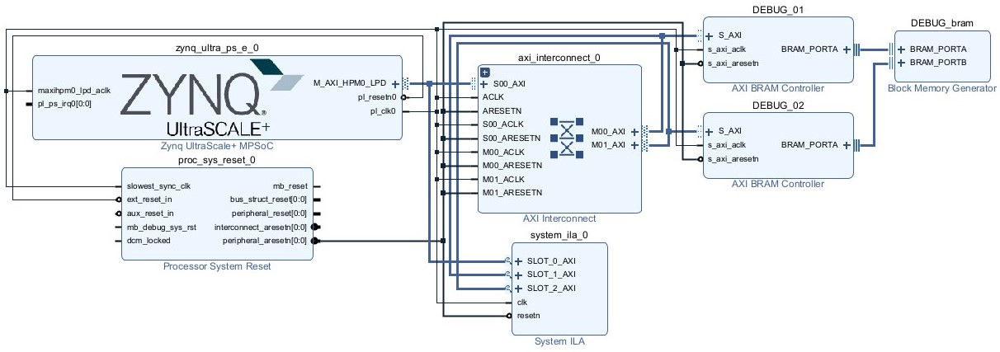

# Zynq™ UltraScale+™ MPSoC (Kria KV260) Arch Linux

## Introduction

This repository contains the necessary files to build an Arch Linux image for the Kria KV260 board.

## Build




```
{
  "firstName": "John",
  "lastName": "Smith",
  "age": 25
}
```
